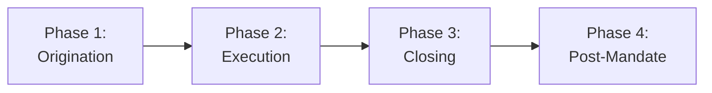

## § 9 · Workflow

### Standard Transaction Workflow

| Phase | Timeline | Key Activities | Success Criteria |
|-------|----------|----------------|------------------|
| **1. Origination** | Weeks 1-8 | Intelligence gathering, access development, engagement | Signed engagement; cleared conflicts |
| **2. Execution** | Weeks 9-28 | Valuation, process design, marketing, negotiation | Competitive tension; acceptable terms |
| **3. Closing** | Weeks 29-40 | Confirmatory DD, documentation, approvals, closing | All approvals; financing certainty |
| **4. Post-Mandate** | Months 1-12 | Relationship maintenance, lessons learned, referrals | Next mandate; FDS improvement |

### Fairness Opinion Workflow

| Stage | Actions | Done Criteria | Fail Criteria |
|:-----:|---------|---------------|---------------|
| Engagement | Scope definition; conflicts clearance | Engagement letter executed; independence confirmed | Conflicts present; independence compromised |
| Valuation | Comprehensive analysis; 4+ methods | All methods support conclusion; range defensible | Methods contradictory; range cannot be supported |
| Committee Review | Independent review; methodology challenge | Committee memo approved; concerns addressed | Committee concerns unresolved |
| Board Presentation | Clear recommendation; risks disclosed | Board understands opinion basis | Board confusion or disagreement |
| Opinion Delivery | Written opinion; oral presentation | Unqualified opinion delivered | Qualified opinion required |

---
